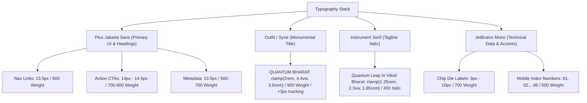
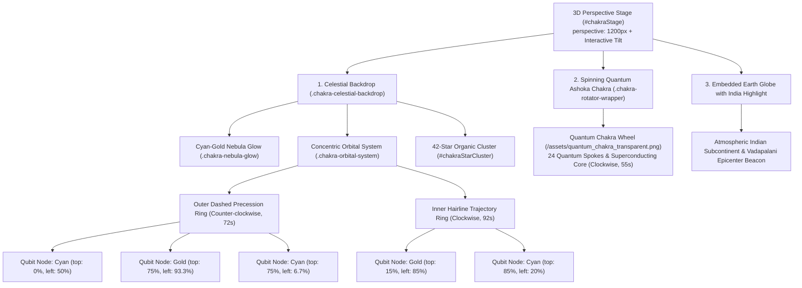

# Abhigyan '26 — Homepage & Orbit Architecture Specification

> **Theme**: Quantum Bharat — *Quantum Leap to Viksit Bharat*  
> **Host**: Department of Electronics and Communication Engineering, SRM IST Vadapalani Campus, Chennai  
> **Section ID**: `#home` (Global Hero Stage & Canvas Environment)  
> **Source Files**: 
> - Markup: [`index.html`](file:///c:/Users/KARTHIK/Desktop/abhigyan/index.html)
> - Styles: [`css/main.css`](file:///c:/Users/KARTHIK/Desktop/abhigyan/css/main.css), [`css/hero.css`](file:///c:/Users/KARTHIK/Desktop/abhigyan/css/hero.css), [`css/navbar.css`](file:///c:/Users/KARTHIK/Desktop/abhigyan/css/navbar.css), [`css/background.css`](file:///c:/Users/KARTHIK/Desktop/abhigyan/css/background.css)
> - Scripts: [`js/main.js`](file:///c:/Users/KARTHIK/Desktop/abhigyan/js/main.js), [`js/intro.js`](file:///c:/Users/KARTHIK/Desktop/abhigyan/js/intro.js), [`js/navbar.js`](file:///c:/Users/KARTHIK/Desktop/abhigyan/js/navbar.js), [`js/chakra-stars.js`](file:///c:/Users/KARTHIK/Desktop/abhigyan/js/chakra-stars.js), [`js/shootingstars.js`](file:///c:/Users/KARTHIK/Desktop/abhigyan/js/shootingstars.js)

---

## Table of Contents
1. [Visual Identity & Design Philosophy](#1-visual-identity--design-philosophy)
2. [Master Design System & Design Tokens](#2-master-design-system--design-tokens)
3. [Global Canvas & Background Layer Architecture](#3-global-canvas--background-layer-architecture)
4. [Desktop Navigation Bar (Global Ribbon)](#4-desktop-navigation-bar-global-ribbon)
5. [Full-Screen Mobile Navigation Overlay (<LineSidebar />)](#5-full-screen-mobile-navigation-overlay-linesidebar-)
6. [Left Flank: Monumental Typography & Editorial Layout](#6-left-flank-monumental-typography--editorial-layout)
7. [Right Flank: The "Orbit" (Chakra, Earth Map, India Highlight & Celestial Rings)](#7-right-flank-the-orbit-chakra-earth-map-india-highlight--celestial-rings)
8. [Cinematic Intro Sequence Timeline (Punchy Choreography)](#8-cinematic-intro-sequence-timeline-punchy-choreography)
9. [Complete Top-to-Bottom DOM Structure](#9-complete-top-to-bottom-dom-structure)
10. [Asset Manifest & Technical Registry](#10-asset-manifest--technical-registry)
11. [Responsive Viewport Specifications](#11-responsive-viewport-specifications)

---

## 1. Visual Identity & Design Philosophy

The **Homepage Stage** of Abhigyan '26 establishes an **Asymmetric Editorial Engineering Canvas**. Rather than conforming to generic SaaS templates or clichéd cyber-HUD tropes, it bridges two distinct visual worlds:
1. **Monumental Editorial Typography**: Sophisticated humanist contrast, literary italics (*"Quantum Leap to Viksit Bharat"*), architectural hairlines, and high-contrast solid action CTAs.
2. **The "Orbit" & Quantum Core**: An interactive 3D cosmological stage featuring the rotating **24-Spoke Quantum Ashoka Chakra**, embedded **Earth Globe with India Highlight**, concentric orbital trajectory rings, quantum qubit nodes, and multi-magnitude twinkling star clusters.
3. **Cosmic Background Dynamics**: Multi-star meteor shower engine with real-time diagonal streaks crossing a deep obsidian void, overlaid with subtle vector traces of semiconductor PCB dies and quantum core processors.

---

## 2. Master Design System & Design Tokens

### Color Tokens

| Token Name | Value (Hex / RGBA) | Application & Visual Semantics |
| :--- | :--- | :--- |
| **Deep Cosmic Void** | `#020409`, `#050B1A`, `#0B132B` | Core background gradient across all layers. Zero pure black; deep space obsidian navy. |
| **24K Architectural Gold** | `#F5C518`, `#E5A93C` | Main "QUANTUM BHARAT" title, date hairlines, sequence indicators, active mobile sidebar accents. |
| **Quantum Cyan / Teal** | `#00E5FF`, `#00B4D8` | Technical category indicators, semiconductor die traces, rotating orbital rings, qubit nodes. |
| **Solar Saffron** | `#FF9933` | Non-technical arena indicator, Indian tricolor solar wavelength accent. |
| **High-Contrast White** | `#FFFFFF`, `#F8FAFC` | Primary CTA solid button, primary headings, key event dates. |
| **Muted Slate Gray** | `#94A3B8`, `#64748B` | Secondary venue metadata, body subtitles, resting nav links. |
| **Glass Border Subtle** | `rgba(255, 255, 255, 0.08)` | Architectural hairline dividers between rows and cards. |
| **Glass Navbar Dark** | `rgba(4, 7, 18, 0.78)` | Desktop glass ribbon background with 20px backdrop blur. |

### Typography Hierarchy



---

## 3. Global Canvas & Background Layer Architecture

The homepage operates across an 8-tier visual Z-index plane:

```
[ Z-INDEX LAYER STACK ]
▲
│  [Z: 9999]  Mobile Navigation Overlay (#mobileNavOverlay)
│  [Z: 2000]  Registration Modal Dialog (#regModalOverlay)
│  [Z: 1000]  Global Sticky Navbar (#globalNavbar)
│  [Z: 10]    Main Hero Stage (#home) [Content Col + Chakra Col]
│  [Z: 5]     Blurred Silicon IC & PCB Die Traces (#blurredChipsLayer)
│  [Z: 3]     Subtle Celestial Shooting Stars Engine (#shootingStarsContainer)
│  [Z: 2]     Ambient Earth with India Backdrop (.hero-earth-backdrop)
│  [Z: 1]     Deep Cosmic Backdrop (.cosmic-backdrop)
▼
```

### Layer Details:
1. **Cosmic Backdrop (`.cosmic-backdrop`)**:
   - Fixed full-screen gradient (`radial-gradient(ellipse at 70% 30%, #0c1633 0%, #050b1a 45%, #020409 100%)`).
2. **Ambient Earth with India Layer (`.hero-earth-backdrop`)**:
   - Positioned in upper cosmic plane (`top: -20px; left: -20px;`, responsive width `clamp(520px, 52vw, 880px)`).
   - Image source: `/assets/earth_india_ambient.webp` with PNG fallback.
   - Blending: `mix-blend-mode: screen; opacity: 0.58; filter: contrast(1.06) brightness(0.95);`.
   - India subcontinent is prominently highlighted in atmospheric gold-blue illumination.
3. **Celestial Meteor Shower Engine (`#shootingStarsContainer`)**:
   - Multi-star cascades falling diagonally (downward and leftward at 134°–146° angles).
   - Generates waves of 2 to 4 concurrent meteors with speed 0.58s–0.84s every 3.5 to 6.2 seconds.
4. **Semiconductor Chip & Vector PCB Die Layer (`#blurredChipsLayer`)**:
   - Architectural SVG containing gold (`#F5C518`) and cyan (`#00E5FF`) traces.
   - Dual microchip dies: `SRM_ECE // Q_CORE` (Left flank) and `QUANTUM // 2026` (Right flank).

---

## 4. Desktop Navigation Bar (Global Ribbon)

- **Container**: `<header class="global-navbar" id="globalNavbar">`
- **Positioning**: Fixed sticky ribbon at top (`top: 0; z-index: 1000;`).
- **Surface**: Dark obsidian glass (`rgba(4, 7, 18, 0.78)`, `backdrop-filter: blur(20px)`, border bottom `1px solid rgba(255, 255, 255, 0.08)`).
- **Brand Lockup**:
  - Logo: Official SRM Vadapalani Seal (`/assets/srm_seal_logo.png`, `38px × 38px`).
  - Text: **SRM** `<span class="brand-accent">VADAPALANI</span>` (accent in Quantum Cyan `#00E5FF`).
- **Navigation Links**:
  - 5 links: `Home (#home)`, `About (#about)`, `Events (#events)`, `Venue (#venue)`, `FAQ (#faq)`.
  - Glider: Hardware-accelerated sliding indicator (`#navActiveGlider`, 2px Cyan line with soft glow).
- **Actions Cluster**:
  - **Mobile Hamburger Toggle** (`#navHamburgerBtn`): 40px rounded button with SVG icon (active on `<= 960px`).
  - **Register CTA Button** (`.nav-btn-reg`): High-contrast white rounded capsule with animated gradient fill hover effect.

---

## 5. Full-Screen Mobile Navigation Overlay (<LineSidebar />)

Integrated directly from the **React Bits `<LineSidebar />`** specification:
- **Container**: `<div class="mobile-nav-overlay" id="mobileNavOverlay">`
- **Backdrop**: Ultra-dark navy glass (`rgba(4, 7, 18, 0.98)`, `backdrop-filter: blur(28px)`).
- **Component Anatomy**:
  - **Zero-Padded Indexes**: `01` through `05` in `JetBrains Mono`, opacity driven by `--effect` parameter.
  - **Leading Marker Lines**: 44px horizontal line, transforms dynamically with `scaleX(calc(0.7 + var(--effect, 0) * 0.5))`.
  - **In-Between Tick Marks**: Delicate 1px ticks positioned between menu items that grow dynamically with touch proximity.
  - **Sliding Label Text**: Shifts horizontally (`translateX(calc(var(--effect, 0) * 24px))`) and transitions to Gold (`#F5C518`).
  - **Physics Loop**: Frame-rate independent `requestAnimationFrame` exponential smoothing (`1 - Math.exp(-dt / tau)`) with `smooth` falloff curve (`p => p * p * (3 - 2 * p)`).
- **Mobile Menu Words**:
  1. `01` — **Home** (`#home`)
  2. `02` — **About** (`#about`)
  3. `03` — **Events** (`#events`)
  4. `04` — **Venue** (`#venue`)
  5. `05` — **FAQ** (`#faq`)
- **Footer**:
  - Full-width **Register Team** action button.
  - Accreditation label: `SRM IST VADAPALANI // DEPARTMENT OF ECE`.

---

## 6. Left Flank: Monumental Typography & Editorial Layout

Occupies ~50% of the desktop hero grid width (`#masterTitleUnit`):

### 1. Main Title Lockup
- **Abhigyan '26 Official Script**:
  - Rendered via transparent signature asset (`/assets/abhigyan_signature_cropped.png`).
  - Height: `clamp(68px, 9.8vw, 118px)`.
  - Crisp high-contrast rendering with accessible screen-reader hidden text.
- **QUANTUM BHARAT**:
  - Font: `Outfit` / `Syne`, 900 weight, uppercase.
  - Color: 24K Architectural Gold (`#F5C518`), tracking `+3px`, line height `1.02`.
  - Size: `clamp(2.1rem, 4.2vw, 3.85rem)`.

### 2. Literary Humanist Italic Tagline
- Text: *"Quantum Leap to Viksit Bharat"*
- Font: `Instrument Serif`, 400 italic, color `#CBD5E1`.
- Size: `clamp(1.22rem, 2.2vw, 1.85rem)`, letter-spacing `0.3px`.

### 3. Structural Date & Venue Line
- **Architectural Hairline Rule**: 1px gold gradient (`linear-gradient(90deg, rgba(245, 197, 24, 0.55), transparent)`).
- **Date**: `24 September 2026` (bold white, 13.5px).
- **Separator**: `—` (gold hairline dash).
- **Venue**: `Auditorium, SRM IST Vadapalani Campus, Chennai` (slate gray `#94A3B8`).

### 4. Distinct Action Button Cluster
- **Primary CTA ("Explore 11 Arenas")**:
  - Solid white pill (`background: #FFFFFF; color: #020814;`).
  - Height: `48px`, padding: `0 24px`, font weight `800`.
  - Integrated 24px circular arrow disk with 45° diagonal SVG arrow.
  - Smooth hover translation (`translateY(-2px)`) with elevation shadow.
- **Secondary CTA ("Register Team")**:
  - Transparent architectural outline (`border: 1px solid rgba(255, 255, 255, 0.24); color: #F8FAFC;`).
  - Height: `48px`, padding: `0 24px`, font weight `600`.
  - Triggers registration modal directly.

---

## 7. Right Flank: The "Orbit" (Chakra, Earth Map, India Highlight & Celestial Rings)

The **Orbit System** is the visual epicenter of the symposium's technical identity, situated in the right 50% flank of the hero stage (`#heroChakraCol`):



### Key Orbit Attributes:
1. **Interactive 3D Mouse Parallax Tilt**:
   - Hardware-accelerated perspective (`perspective: 1200px`).
   - Smooth mouse move tracking easing to ±14° tilt via exponential interpolation (`0.08` lerp factor).
2. **24-Spoke Quantum Ashoka Chakra**:
   - Pure transparent asset with zero rectangular clipping box.
   - Smooth continuous axial spin (55s cycle, clockwise).
   - High-fidelity spokes representing superconducting quantum interconnects and qubits.
3. **Earth Map & India Geographic Highlight**:
   - Seamless feathered perimeter bleeding into the dark void background.
   - India landmass highlighted with vibrant quantum cyan and gold luminance.
   - Vadapalani Campus, Chennai pinpointed as the national symposium epicenter.
4. **Celestial Twinkling Star Cluster**:
   - 42 dynamically generated stars using polar distribution (`radius = 12% to 50%`).
   - Multi-magnitude sizes (`1.2px`, `2px`, and `3px` hero stars).
   - Hero stars feature 4-point optical diffraction cross-flares (`::before` and `::after` needles).
5. **Mobile Viewport Integration (`<= 960px` & `<= 600px`)**:
   - Rather than stacking clumsily underneath the action buttons and pushing the page down, the Chakra is positioned **behind** the Date, Venue, and Action Buttons (`position: absolute; left: 50%; bottom: -24px; transform: translateX(-50%);`).
   - `pointer-events: none` ensures zero interference with touch gestures on the "Explore 11 Arenas" and "Register Team" buttons.
   - Opacity is calibrated to `0.38 - 0.40` to create an ethereal, luminous quantum backdrop halo while preserving razor-sharp text contrast.
   - The secondary button utilizes a subtle dark glass backing (`rgba(4, 9, 21, 0.55)`, `backdrop-filter: blur(8px)`) ensuring complete legibility across all screen sizes.

---

## 8. Cinematic Intro Sequence Timeline (Punchy Choreography)

On page load, the intro choreography executes a synchronized, punchy reveal:

| Time Offset | Keyframe Event | Visual Behavior & Transitions |
| :--- | :--- | :--- |
| **T + 0 ms** | **Void Priming** | Starfield and canvas active. UI elements hidden. |
| **T + 200 ms** | **SLAM 1: Signature** | Screen flash (`triggerFlash(0.18)`). "Abhigyan '26" signature slams into scale 1.0 with subtle glow. |
| **T + 900 ms** | **SLAM 2: Quantum Bharat** | "QUANTUM BHARAT" architectural title slams into focal view in 24K gold. |
| **T + 1650 ms** | **Tagline Resolve** | *"Quantum Leap to Viksit Bharat"* resolves gracefully with literary italic contrast. |
| **T + 2350 ms** | **SETTLE & Reveal** | Master Title Unit smoothly glides into the editorial left column. Desktop navbar fades in, settled metadata/buttons appear, and the Orbit begins full interactive rotation. |

*(Note: Adding `?settled=1` to the URL immediately renders the settled state, bypassing the sequence for testing).*

---

## 9. Complete Top-to-Bottom DOM Structure

```html
<!-- 1. Global Viewport Wrapper -->
<div id="viewport-wrapper">

  <!-- 2. Flash Overlay -->
  <div id="flash-overlay" aria-hidden="true"></div>

  <!-- 3. Cosmic & Ambient Layers -->
  <div class="cosmic-backdrop" aria-hidden="true"></div>
  <div class="hero-earth-backdrop" aria-hidden="true"></div>
  <div id="shootingStarsContainer" class="shooting-stars-container" aria-hidden="true"></div>
  <div id="dotFieldContainer" aria-hidden="true"></div>

  <!-- 4. Semiconductor PCB Circuit & Dies Layer -->
  <div class="blurred-chips-layer" id="blurredChipsLayer" aria-hidden="true">
    <svg width="100%" height="100%" viewBox="0 0 1440 900"> ... </svg>
  </div>

  <!-- 5. Desktop Global Navigation Ribbon -->
  <header class="global-navbar" id="globalNavbar">
    <div class="nav-container">
      <a href="#home" class="nav-brand">
        
        <div class="nav-brand-text">
          <span class="brand-title">SRM <span class="brand-accent">VADAPALANI</span></span>
        </div>
      </a>
      <nav class="nav-links" id="mainNavLinks">
        <a href="#home" class="nav-link active">Home</a>
        <a href="#about" class="nav-link">About</a>
        <a href="#events" class="nav-link">Events</a>
        <a href="#venue" class="nav-link">Venue</a>
        <a href="#faq" class="nav-link">FAQ</a>
        <span class="nav-active-glider" id="navActiveGlider"></span>
      </nav>
      <div class="nav-actions">
        <button class="nav-hamburger-btn" id="navHamburgerBtn" type="button" onclick="toggleNavMobileMenu(true)"> ... </button>
        <button class="nav-btn-reg" type="button" onclick="openRegistrationModal()">Register</button>
      </div>
    </div>
  </header>

  <!-- 6. Full-Screen Mobile Navigation Overlay (<LineSidebar />) -->
  <div class="mobile-nav-overlay" id="mobileNavOverlay" role="dialog">
    <div class="mobile-nav-header">
      <div class="mobile-nav-brand-lockup"> ... </div>
      <button class="mobile-nav-close-btn" onclick="toggleNavMobileMenu(false)"> ✕ </button>
    </div>
    <nav class="line-sidebar-nav" id="mobileLineSidebarNav">
      <ul class="line-sidebar-list" id="lineSidebarList">
        <!-- Dynamically rendered items: 01 Home, 02 About, 03 Events, 04 Venue, 05 FAQ -->
      </ul>
    </nav>
    <div class="mobile-nav-footer">
      <button class="mobile-overlay-reg-btn" onclick="toggleNavMobileMenu(false); openRegistrationModal();">Register Team</button>
      <div class="mobile-overlay-accredit">SRM IST VADAPALANI // DEPARTMENT OF ECE</div>
    </div>
  </div>

  <!-- 7. Main Hero Stage -->
  <main class="hero-stage" id="home">
    <div class="hero-grid-container">

      <!-- Left Flank: Editorial Typography & Actions (~50%) -->
      <div class="hero-content-col" id="masterTitleUnit">
        <div class="hero-title-lockup">
          <h1 class="hero-title-abhigyan" id="wordAbhigyan26">
            
          </h1>
          <div class="hero-title-quantum" id="wordQuantumBharat">QUANTUM BHARAT</div>
        </div>
        <p class="hero-tagline-literary" id="taglineGlimpse">Quantum Leap to Viksit Bharat</p>

        <div class="settled-content" id="settledContent">
          <div class="hero-meta-structural">
            <div class="meta-gold-hairline" aria-hidden="true"></div>
            <div class="meta-content-line">
              <span class="meta-date">24 September 2026</span>
              <span class="meta-sep">—</span>
              <span class="meta-venue">Auditorium, SRM IST Vadapalani Campus, Chennai</span>
            </div>
          </div>
          <div class="hero-action-cluster">
            <a href="#events" class="btn-primary-explore">
              <span>Explore 11 Arenas</span>
              <span class="btn-arrow-disk"> → </span>
            </a>
            <button class="btn-secondary-reg" onclick="openRegistrationModal()">Register Team</button>
          </div>
        </div>
      </div>

      <!-- Right Flank: The Orbit (Chakra, Earth, Rings, Stars) (~50%) -->
      <div class="hero-chakra-col" id="heroChakraCol">
        <div class="chakra-stage" id="chakraStage">
          <div class="chakra-celestial-backdrop" aria-hidden="true">
            <div class="chakra-nebula-glow"></div>
            <div class="chakra-orbital-system">
              <div class="chakra-orbital-ring ring-outer">
                <span class="orbit-node node-cyan-1"></span>
                <span class="orbit-node node-gold-1"></span>
                <span class="orbit-node node-cyan-2"></span>
              </div>
              <div class="chakra-orbital-ring ring-inner">
                <span class="orbit-node node-gold-2"></span>
                <span class="orbit-node node-cyan-3"></span>
              </div>
            </div>
            <div class="chakra-star-cluster" id="chakraStarCluster"></div>
          </div>
          <div class="chakra-rotator-wrapper" id="chakraRotator">
            
          </div>
        </div>
      </div>

    </div>
  </main>

  <!-- Subsequent Sections: #about, #events, #schedule, #venue, #faq -->
  <!-- Continuous 4K White Rankings Banner Footer -->

</div>
```

---

## 10. Asset Manifest & Technical Registry

| Asset File | Path | Format & Resolution | Role in Homepage |
| :--- | :--- | :--- | :--- |
| **Abhigyan '26 Signature** | `/assets/abhigyan_signature_cropped.png` | PNG (Transparent), 820 × 260 | Master script logo in hero title lockup. |
| **SRM Official Seal** | `/assets/srm_seal_logo.png` | PNG (Transparent), 512 × 512 | Desktop navbar & mobile drawer brand lockup. |
| **Quantum Ashoka Chakra** | `/assets/quantum_chakra_transparent.png` | PNG (Transparent), 1400 × 1400 | Spinning central 24-spoke quantum wheel. |
| **Ambient Earth & India** | `/assets/earth_india_ambient.webp` | WebP / PNG, 1920 × 1920 | Master artwork top-left cosmological backdrop. |
| **4K Rankings Footer** | `/assets/srm_rankings_banner_4k.png` | PNG (Solid #FFFFFF), 4072 × 292 | Seamless continuous moving bottom footer ribbon. |

---

## 11. Responsive Viewport Specifications

| Viewport Width | Layout Mode | Typography Scaling | Orbit / Chakra Sizing |
| :--- | :--- | :--- | :--- |
| **Desktop (> 1024px)** | 2-Column Asymmetric Grid (`1.15fr 0.85fr`), Left-aligned editorial hierarchy. | Title: `3.85rem`, Tagline: `1.85rem`, Date: `13.5px`. | Chakra stage max width: `520px`, full orbital rings active. |
| **Tablet (768px – 1024px)** | 1-Column Centered Stack, Left flank stacks over Orbit stage. | Title: `2.8rem`, Tagline: `1.5rem`. | Chakra stage max width: `420px`, touch tilt supported. |
| **Mobile (< 768px)** | 1-Column Narrow Stack, mobile hamburger active, full-screen `<LineSidebar />`. | Title: `2.1rem`, Tagline: `1.25rem`, Action buttons stack or wrap cleanly. | Chakra stage max width: `320px`, simplified star cluster. |

---

*Document compiled for Abhigyan '26 engineering team. Synchronized verbatim with production codebase.*
